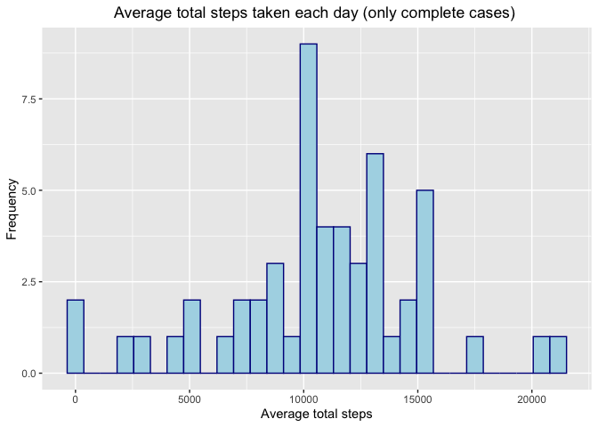
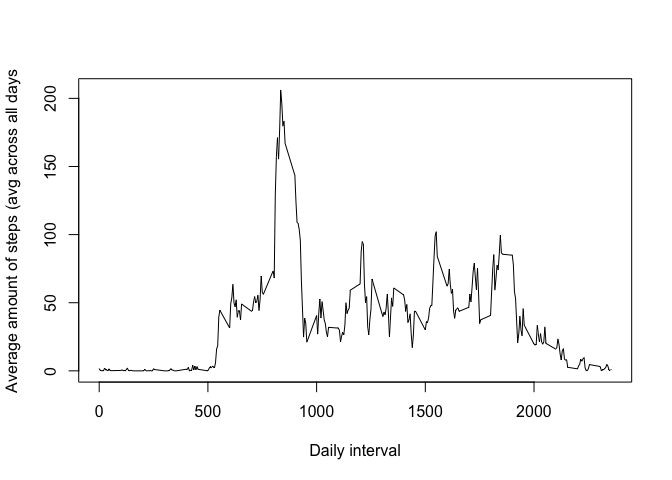
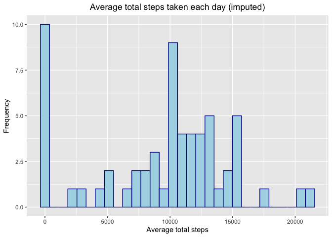
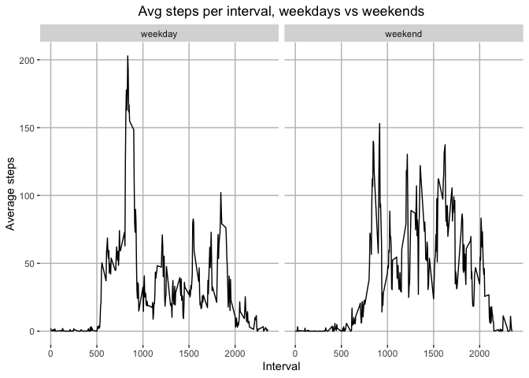

## Loading and preprocessing the data

We are first going to  read in the personal activity monitoring device data set and format it (ie. dates as dates and remove missing values).

```r
activities <- read.csv("activity.csv", stringsAsFactors = FALSE)
activities$date <- as.Date(activities$date,format = "%Y-%m-%d")
activitiescomplete <-  activities[complete.cases(activities[,1]),]
```


## What is mean total number of steps taken per day?
For this assignment I am using the *activitiescomplete* dataframe which consist of only full observations.

Below you can see the method of getting the total steps per day and  the histogram of the total number of steps taken each day:

```r
stepsperday <- activitiescomplete %>% group_by(date) %>% summarise(total_steps=sum(steps))
p <- ggplot(stepsperday,aes(x=total_steps)) +geom_histogram(color="darkblue", fill="lightblue") + labs(title="Average total steps taken each day (only complete cases) ", x="Average total steps", y="Frequency") + theme(plot.title = element_text(hjust=0.5))
p
```

```
## `stat_bin()` using `bins = 30`. Pick better value with `binwidth`.
```

<!-- -->
  
Then, mean total steps per day, so just use summarise-function of dplyr to get the mean of total steps for each day.

```r
stepsperday %>% summarise(mean=mean(total_steps))
```

```
## # A tibble: 1 x 1
##     mean
##    <dbl>
## 1 10766.
```
So the mean of total steps across all dates is **10 766** - not bad daily average.
  
Finally, median of total steps taken each day was calculated as follows: 

```r
stepsperday %>%  summarise(median=median(total_steps))
```

```
## # A tibble: 1 x 1
##   median
##    <int>
## 1  10765
```
So the median of total steps across all recorded dates is **10765**. 


## What is the average daily activity pattern?

Next, the assignment was about creating a time series plot with line-graph of the 5-minute interval on x-axis and the average number of steps taken on each interval across all days on y-axis.

```r
daily_pattern <- activitiescomplete %>% group_by(interval) %>% summarise(average=mean(steps))
plot(x=daily_pattern$interval,y=daily_pattern$average,type="l", xlab="Daily interval", ylab="Average amount of steps (avg across all days")
```

<!-- -->
  
As you can see from the time-series plot we can see that the 5-minute interval where the steps taken is highest is somewhere between intervals 500 and 1000, most likely somewhere in 800th 5-minute interval. But we need the exact interval which is hard to extract from this plot.

So let's use dplyr's summarise function to get first the highest amount of steps in any 5-minute interval.

```r
daily_pattern %>% summarise(max(average))
```

```
## # A tibble: 1 x 1
##   `max(average)`
##            <dbl>
## 1           206.
```

So the highest average amount of steps taken in any 5-minute interval is ~206 steps. Next, let's use dplyr's filter function to find the exact row including the interval when this amount steps has happened.

```r
daily_pattern %>% filter(average>206)
```

```
## # A tibble: 1 x 2
##   interval average
##      <int>   <dbl>
## 1      835    206.
```
  
So the 835th interval is the interval where most amount steps are taken across all recorded dates. And this is weird, because in the assignment it said that these are 5-minute intervals measure during whole day. According to match & logic there should be max amount of 228 5-minute intervals in 24-hour period. But in the dataset the max amount of intervals on each days is 2355 which sounds very strange to me.

## Imputing missing values

In above reports, I have used a subset of the original dataset which only consisted of complete cases (cases that didn't include any missing values). This might introduce a bias in the reports so let's first examine how many rows there are with NAs.
  
  Let's use the negative of *complete.cases* function to get the rows where there are NAs. Then subset the original dataset stored as "activities" and finally pass everything to *nrow*-function to calculate the amount of rows with NAs.

```r
nrow(activities[!complete.cases(activities),])
```

```
## [1] 2304
```
  
So there are 2304 rows with missing values out of all 17568 rows, so around 13% of original dataset contains missing values.
  
So let's use a strategy of replacing all NA-values with zero as was requested in the assignment (tasks 2. and 3. under "Imputing missing values" section)

```r
activitiesimputed <- activities %>% replace(is.na(.), 0)
```
  
Next, let's do the histogram of the total number of steps taken each day. Let's also calculate and report the mean and median total number of steps taken per day with this imputed dataset.

```r
stepsperdayimputed <- activitiesimputed %>% group_by(date) %>% summarise(total_steps=sum(steps))
  
p <- ggplot(stepsperdayimputed,aes(x=total_steps)) +geom_histogram(color="darkblue", fill="lightblue") + labs(title="Average total steps taken each day (imputed)", x="Average total steps", y="Frequency") + theme(plot.title = element_text(hjust=0.5))
p
```

```
## `stat_bin()` using `bins = 30`. Pick better value with `binwidth`.
```

<!-- -->


```r
stepsperdayimputed %>% summarise(mean=mean(total_steps))
```

```
## # A tibble: 1 x 1
##    mean
##   <dbl>
## 1 9354.
```
  
So with imputed dataset where NA values were converted to zero, the median amount of steps taken each day is naturally lower than with a dataset that consists of only complete cases. In this case **9354** average daily steps in imputed dataset vs. **10766** average daily steps in complete cases dataset. 
  
Let's look at the median amount of total daily steps taken each day across the measurement period.

```r
stepsperdayimputed %>% summarise(median=median(total_steps))
```

```
## # A tibble: 1 x 1
##   median
##    <dbl>
## 1  10395
```
  
Here we can see greater different between mean and median of imputed dataset compared to dataset consisting of only complete cases, which makes sense.

## Are there differences in activity patterns between weekdays and weekends?
This assignment asked first to turn the dates to a simple factor variable which contains two levels: weekday or weekend, indicating whether the date on each case is happening in weekend or weekday.

Let's first do this magic with dplyr's amazing tools.


```r
weekdays <- activitiesimputed %>% mutate(weekday=factor(if_else(wday(date,week_start = 1)<6,"weekday","weekend","missing")))

#A short summary of the newly created dataframe consisting of a new factor variable named weekday...
str(weekdays)
```

```
## 'data.frame':	17568 obs. of  4 variables:
##  $ steps   : num  0 0 0 0 0 0 0 0 0 0 ...
##  $ date    : Date, format: "2012-10-01" "2012-10-01" ...
##  $ interval: int  0 5 10 15 20 25 30 35 40 45 ...
##  $ weekday : Factor w/ 2 levels "weekday","weekend": 1 1 1 1 1 1 1 1 1 1 ...
```
  
Then the assignment was to make a panel plot containing a time series plot of the 5-minute interval on x-axis and the average number of steps take averaged across all weekday days or weekend days on y-axis. 


```r
weekdays <- weekdays %>% group_by(interval,weekday) %>% summarise(avgsteps=mean(steps))
p <- ggplot(weekdays,aes(interval,avgsteps)) + geom_line() + labs(x="Interval",y="Average steps",title = "Avg steps per interval, weekdays vs weekends") + theme(plot.title = element_text(hjust = 0.5),panel.background = element_blank(),panel.grid.major = element_line(colour = "grey",linetype = 1))
p <- p + facet_wrap(vars(weekday))
p
```

<!-- -->
  
It is clearly noticeable from this dataset that during weekdays, walking starts earlier than during weekends. Also, on weekends the difference of amount of steps taken throughout the day is more even than on weekdays and lasts further to evening.
